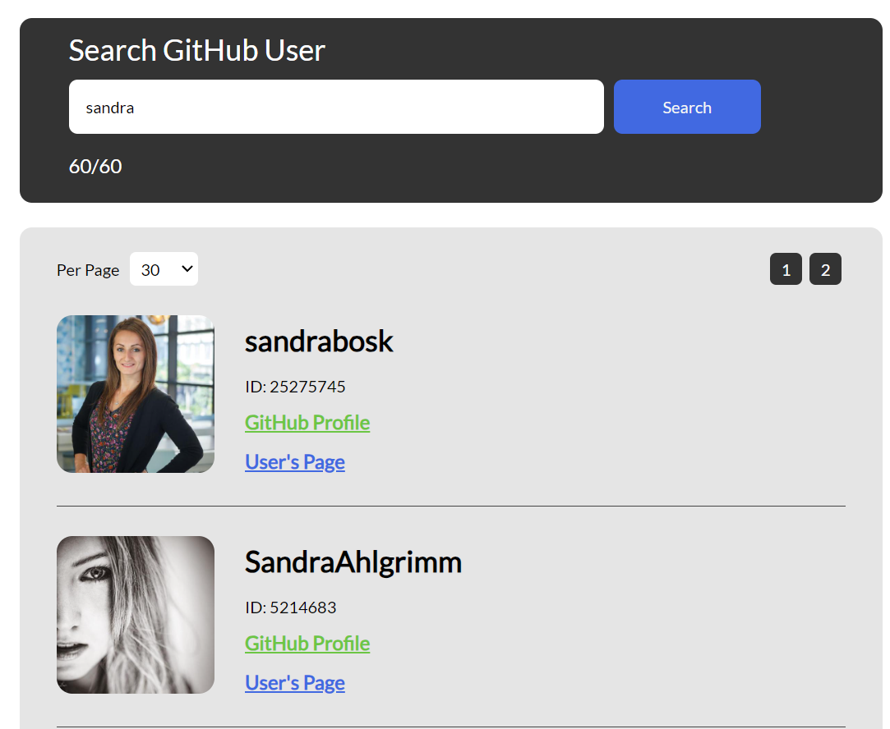
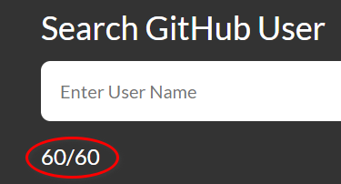

# GitHub Web App

**Table of Contents**

- [Introduction](#introduction)
- [Installation](#installation)
- [Launching the App](#launch)
- [The GitHub Endpoints](#endpoints)
  - [Get users whose username matches a specific pattern](#users)
  - [Get data based on a specific username](#data)
  - [Get information for the latest git commits of a repo](#commits)
  - [Get the remaining number of GitHub requests your IP address is allowed to consume](#requests)
- [App Usage](#usage)
- [Caution](#caution)
- [Creator](#creator)

<a id="introduction"></a>

## Introduction

This is a fullstack app that searches for GitHub members. Secondly, after selecting a specific user, a different page is generated that renders detailed information about the user and the repos belonging to that user.

All the search-and-fetch functionality is achieved via the GitHub API: `https://api.github.com/`. In this project we only concern ourselves with publicly accessible API endpoints.

<a id="installation"></a>

## Installation

Clone the repo to the desired location, and `cd` into that folder. In the command line, execute `npm install`. Furthermore, `cd` into the `frontend-client` folder, and similarly execute `npm install`. At this point you should have `package.json` and `node_modules` for both the root folder and the `frontend-client` folder.

<a id="launch"></a>

## Launching the App

- In the root folder, execute `npm start` from the command line. You should get output that says: _Server is listening on port 8000._
- In the `frontend_client` folder, execute `npm start` from the command line. This should by default spin up a browser tab at `https://localhost:3000`.
- After doing the aforementioned executions, you should now be able to interact with the `User Interface`.

<a id="endpoints"></a>

## The GitHub End Points

<a id="users"></a>

### Get users whose username matches a specific pattern

`GET "/search-users/:username&:perPage&:page"`

`https://api.github.com/search/users?q={username}+in:login+type:User&page={page}&per_page={perPage}`

Some sample output are as follows:

```json
{
  "login": "henri",
  "id": 30340,
  "node_id": "MDQ6VXNlcjMwMzQw",
  "avatar_url": "https://avatars.githubusercontent.com/u/30340?v=4",
  "gravatar_id": "",
  "url": "https://api.github.com/users/henri",
  "html_url": "https://github.com/henri",
  "followers_url": "https://api.github.com/users/henri/followers",
  "following_url": "https://api.github.com/users/henri/following{/other_user}",
  "gists_url": "https://api.github.com/users/henri/gists{/gist_id}",
  "starred_url": "https://api.github.com/users/henri/starred{/owner}{/repo}",
  "subscriptions_url": "https://api.github.com/users/henri/subscriptions",
  "organizations_url": "https://api.github.com/users/henri/orgs",
  "repos_url": "https://api.github.com/users/henri/repos",
  "events_url": "https://api.github.com/users/henri/events{/privacy}",
  "received_events_url": "https://api.github.com/users/henri/received_events",
  "type": "User",
  "site_admin": false,
  "score": 1
}
```

<a id="data"></a>

### Get data based on a specific username

`GET "/get-user/:username"`

Based on the `username` parameter, the Backend actually performs two searches:

- `https://api.github.com/users/${username}`
- `https://api.github.com/users/{username}/repos?sort=updated_at&per_page=5`

The first one gets more detailed information on the user (or username). The second provides a sample of repositories created by that user. In the backend, these two outputs are then merged together in a single JSON object that gets further manipulated in the business logic of the App.

<a id="commits"></a>

### Get information for the latest git commits of a repo.

E.g.: `https://api.github.com/repos/{username}/{repoName}/commits`

You will see this fetch taking place in the `CommitCard.js` component. This endpoint is not explicitly defined in the Express `index.js` file.

<a id="requests"></a>

### Get the remaining number of GitHub requests your IP address is allowed to consume

`GET "/get-limit"`

`https://api.github.com/rate_limit`

Here is some sample data:

```json
{
  "resources": {
    "core": {
      "limit": 60,
      "remaining": 59,
      "reset": 1691497487,
      "used": 1,
      "resource": "core"
    },
    "graphql": {
      "limit": 0,
      "remaining": 0,
      "reset": 1691497786,
      "used": 0,
      "resource": "graphql"
    },
    "integration_manifest": {
      "limit": 5000,
      "remaining": 5000,
      "reset": 1691497786,
      "used": 0,
      "resource": "integration_manifest"
    },
    "search": {
      "limit": 10,
      "remaining": 10,
      "reset": 1691494246,
      "used": 0,
      "resource": "search"
    }
  },
  "rate": {
    "limit": 60,
    "remaining": 59,
    "reset": 1691497487,
    "used": 1,
    "resource": "core"
  }
}
```

<a id="usage"></a>

## App Usage

The url `https://localhost:3000` should take you to the Home page of the app. You will notice that this page features a Search engine. More specifically, it allows you to search for GitHub users by `username`. Let's say for argument's sake that your search term is `"sandra"`. You should now see a list of GitHub users whose `username` contains `"sandra"`.

Here is an image illustrating the search results:


For each user, there is a link <a href="#">GitHub Profile</a> that will take you to the GitHub profile for that specific user. Secondly, <a href="#">User's Page</a> will give you a more granular view of the selected user.

Let's venture that you clicked on the user `"SandraAhlgrimm"`. As a result your address bar should now display <a href="#">localhost:3000/user/SandraAhlgrimm</a>. On this page, the header portion will display data about the user. The body of the page contains 5 "cards", each corresponding to a specific repository. As of 8 August 2023, you should see the following Repo Titles: `azure-maven-plugins`, `anyonecancode`, `quarkus-azure-services`, `azure-gradle-plugins`, and `quarkus-azure-functions-http`. If available, for each repo you should also see the latest 5 commit messages in bullet format.

<a id="caution"></a>

## Caution

If the API limit-rate is exceeded, then the App will appear to be 'frozen' and unresponsive. An indicator of how many requests are still available can be found beneath the Search Input Field, however it seems that this counter is not smoothly updated after each call. As a result, the App is unfortunately finicky.



<a id="creator"></a>

## Creator

<a href="https://github.com/HenriBranken">Henri Branken</a> 🎑🎑
